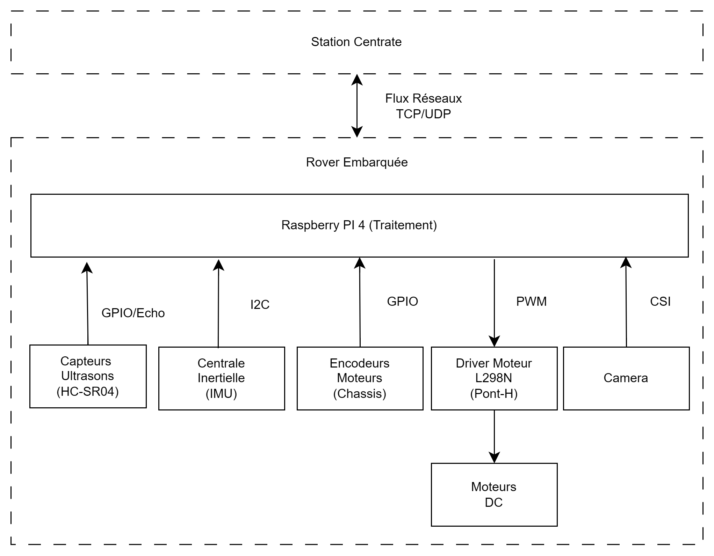
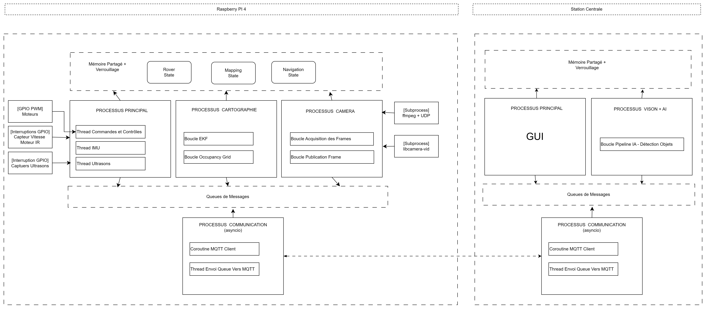
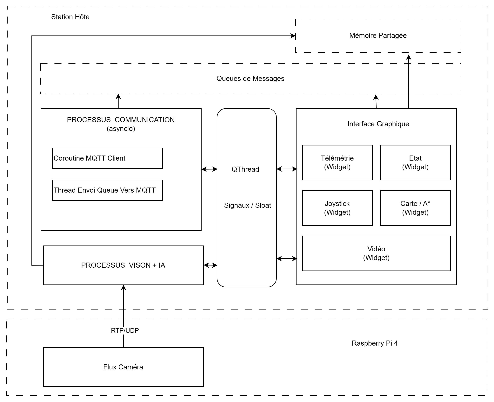
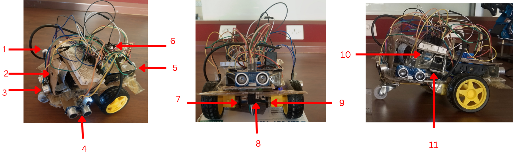

# Rover SLAM

An autonomous indoor mapping rover designed for real-time localization and environment reconstruction using multi-sensor fusion and distributed system architecture.

# Abstract

This project focuses on the design of a distributed indoor autonomous mapping rover
running Raspberry Pi 4 OS. The software architecture, developed in Python 3.8, optimizes
network bandwidth and hardware resources by isolating critical tasks through multi
processing and multi-threading.

The rover is powered by three 18650 Li-ion batteries for power and an independent
Power Bank for logic control by a microcontroller, sharing a common star-grounded confi
guration on a breadboard. For localization, an Extended Kalman Filter (EKF) fuses wheel
odometry with the ωz angular velocity from a rear-mounted IMU. A discrete PID control
loop (20 Hz) executes a ”Turn-and-Drive” strategy with crisp motor cuts. Mapping relies
on a probabilistic ultrasonic occupancy grid, limited to 120 cm to drop sensor latency to
28 ms.

To achieve real-time performance, YOLOv8nano video inference is offloaded to the
base station. The rover leverages libcamera and FFmpeg to stream raw frames over
RTP/UDP, which are smoothly decoded between 22 and 28 FPS using the PyAV py
thon’s library. Telemetry and commands are routed over a local Wi-Fi network via the
Eclipse Mosquitto broker hosted on the remote station, optimized through data buffering
on the Raspberry Pi 4.

The PyQt6 interface centralizes multi-window supervision, logs, and PID diagnostics.
It features three driving modes : manual via a virtual joystick, autonomous through a
360° angular histogram used for obstacle avoidance, or waypoint tracking planned by the
A* algorithm. Experimental tests validate an EKF drift below 4 cm and a geolocalized
annotation precision within ±4 cm.

## Architecture



### Embeded Software architecture


### Remote Station Software architecture


## Rover



## Installation
Use virtualenv

### Windows
pip install "av==14.4.0" --only-binary=:all: 

## Run applications

### Raspberry Pi 4
On the raspberry PI we have to run the main application after creating a yaml config file
```bash
python -X faultenable main_raspberry_hardware.py
```

### Windows 11
Start the ui application
```
python main_ui.py --conf config_ui.local.yml
```

## Issues and Solution
Install package and ignore not compatible
```bash
python -c "import subprocess; [subprocess.run(['pip', 'install', line.strip()]) for line in open('requirements.txt') if line.strip() and not line.startswith('#')]"

```

Test remote connection ofrom raspberry pi to a remote
```
timeout 3 bash -c '</dev/tcp/192.168.1.100/80' && echo "Open" || echo "Closed"

```


## Central Paltform
- Ui
- RtcProcess for image processing
- SLAMProcess for computation on data

Schema
UI - Qthread(Controller) - Communication Channel - MultiProcessing

# Raspberry video stream 

uing RTSP
sudo apt install ffmpeg libcamera-apps v4l2loopback-dkms


Start the RSTP 
ffmpeg -rtsp_flags listen -i rtsp://0.0.0.0:8554/live -f null -
